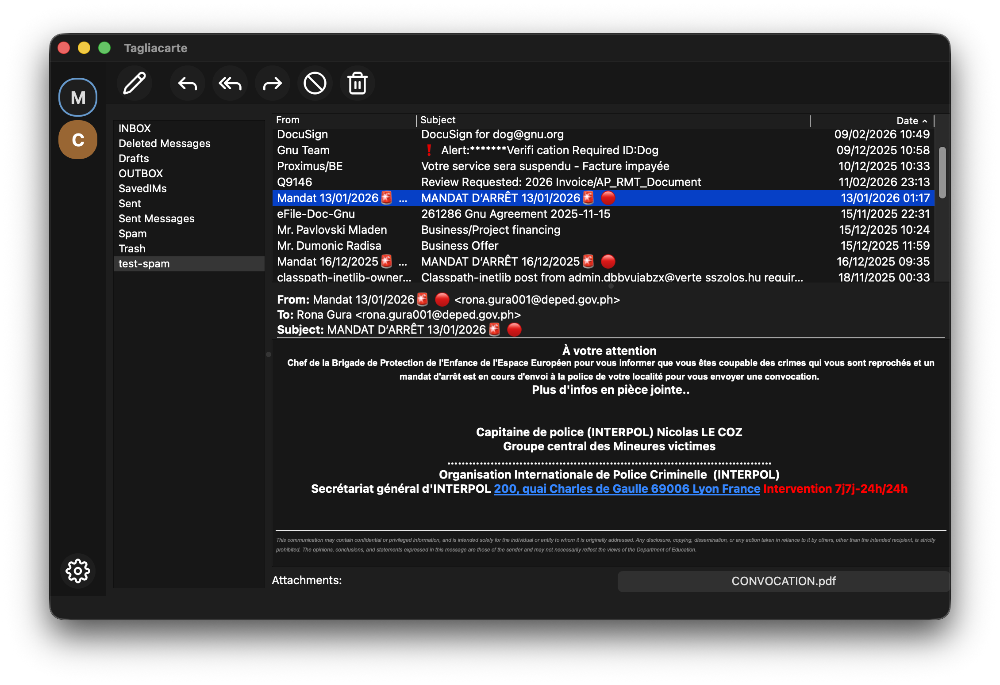

# Tagliacarte

A desktop messaging client with a Rust core and Qt 6 interface. Cross-platform (macOS and Linux first), low latency, standards-based, local-first.

**Work in progress.**



## Protocols and storage

| Layer | Supported |
|-------|-----------|
| **Mail retrieval** | IMAP4rev2 (STARTTLS, implicit TLS), POP3 (implicit TLS) |
| **Mail transport** | SMTP (STARTTLS, implicit TLS, BDAT/CHUNKING) |
| **Authentication** | SASL: PLAIN, LOGIN, CRAM-MD5, SCRAM-SHA-256 |
| **Message format** | MIME, RFC 5322 |
| **Local storage** | Maildir+, mbox |
| **Future** | Nostr DMs (WebSocket relays), Matrix (HTTP) |

## Technologies

| Component | Technology |
|-----------|------------|
| Core | Rust |
| UI | Qt 6 (C++ / Widgets) |
| FFI bridge | Rust `cdylib` exposing a C API; Qt links against it |
| Build | Cargo (Rust workspace) + CMake (Qt) orchestrated by Make |
| Licence | GPLv3 |

## Streaming architecture and minimal latency

Tagliacarte is designed around an end-to-end streaming, event-driven model so that content reaches the screen with minimal latency, even for large messages.

1. **Protocol layer** -- raw RFC 822 bytes are delivered from the server in chunks as they arrive.
2. **MIME parser** (`core/src/mime/`) -- a push-based, non-blocking parser. Each chunk is fed to `MimeParser::receive()`; complete lines are processed immediately and handler events (`start_entity`, `content_type`, `body_content`, `end_entity`, ...) fire synchronously. Base64 and quoted-printable transfer encodings are decoded incrementally with partial-quantum buffering.
3. **FFI layer** (`ffi/`) -- `FfiMimeHandler` implements the `MimeHandler` trait and forwards every event as a C callback. No intermediate accumulation or heuristics; bytes flow straight from the protocol into the parser and out as typed events.
4. **UI** (`ui/EventBridge`) -- callbacks are marshalled to the Qt main thread via `QMetaObject::invokeMethod` with `Qt::QueuedConnection`. Plain-text body content is appended progressively to the view as chunks arrive; HTML parts are assembled per-entity and rendered on `end_entity`. CID-referenced images are resolved on demand from a shared registry.

The result: the top of a message is visible while the rest is still streaming from the server.

## Internationalisation and localisation

Tagliacarte is fully internationalised using Qt Linguist. All user-facing strings are keyed (lowercase, dot-separated, e.g. `accounts.add_imap`) and support ICU MessageFormat where needed.

Translations are provided for **10 locales**: English, French, German, Spanish, Italian, Portuguese, Greek, Russian, Chinese (Simplified), and Japanese.

Source `.ts` files live in `ui/l10n/`; compiled `.qm` files are generated at build time and bundled into the application.

## Layout

- **`core/`** -- Rust crate: Store / Folder / Message / Transport traits; IMAP, POP3, SMTP, Maildir, mbox, MIME, SASL.
- **`ffi/`** -- Rust cdylib and C headers for the core API.
- **`ui/`** -- Qt 6 application (folder sidebar, message list, message view, compose).
- **`ui/l10n/`** -- Translation source files (`.ts`).
- **`icons/`** -- Application icon sources and generated assets.

## Build

**Prerequisites:** Rust (via [rustup](https://rustup.rs)), CMake (>=3.16), Qt 6.

```bash
make                # release build (Rust + Qt)
make debug          # debug build
make run            # build and run
make test           # run tests
make clean          # clean all build artefacts
```

If CMake cannot find Qt 6, set `QT_PREFIX`:

```bash
# macOS (Homebrew)
brew install cmake qt@6
make QT_PREFIX=$(brew --prefix qt@6)

# macOS (Qt installer)
make QT_PREFIX=~/Qt/6.x.x/macos

# Linux (apt)
sudo apt install cmake qt6-base-dev
make QT_PREFIX=/path/to/Qt/6.x/gcc_64
```

---

**Licence:** GPLv3. See [COPYING](COPYING).

**Author:** Chris Burdess
