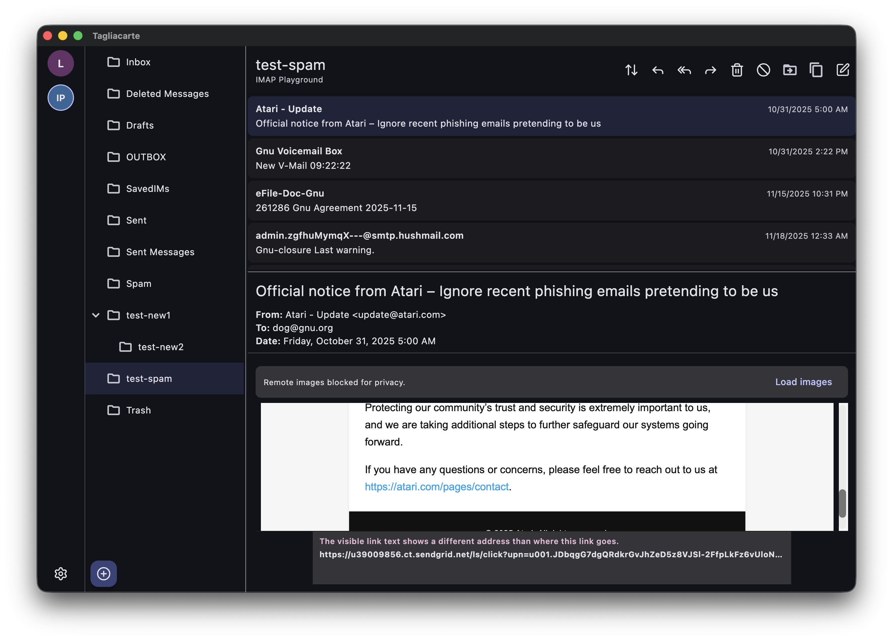

# Tagliacarte

A desktop/mobile messaging client with a Rust core and Flutter/terminal interface. Cross-platform (Linux, macOS, Windows, Android, iOS), low latency, standards-based, event-driven.

**Work in progress.**



## Features

- TLS (1.3, 1.2) support throughout
- SASL authentication mechanisms usable by all protocols:
  - `PLAIN`
  - `LOGIN`
  - `CRAM-MD5`
  - `SCRAM-SHA-256`
  - `XOAUTH2`
- OAuth2: PKCE auth code + refresh; Google + Microsoft bearer token store
- platform or local encrypted credentials storage
- IMAP4rev2
  - `STARTTLS` support
  - subscribed folders support
  - `UIDVALIDITY` + `EXISTS` for list invalidation
  - `UID SORT` (RFC 5256) when `SORT` advertised
  - `FETCH` / `UID FETCH`: streamed tuned MIME fragments
  - uses UIDs for efficiency if possible
  - mark/expunge or move to trash behaviour
  - idle support
  - second authenticated session for mail-body HTTPS: interleaved `FETCH` literals → chunked HTTP for WebView (cid: URLs in HTML body content)
- SMTP
  - `STARTTLS` support
  - use `BDAT` when `CHUNKING` possible
  - `DSN` + `NOTIFY=`
- POP3
  - `STLS` support
- NNTP
  - `STARTTLS` support
  - .newsrc newsgroup subscription
  - newsgroup browsing
- Maildir+ hierarchical local storage
- mbox single mailbox local storage
- Microsoft Graph API
- Gmail REST API
  - HTTP/2 parallel GET
- Nostr direct messages
  - WebSocket relays
  - NIP-04 kind 4
  - NIP-17 gift wraps (kind 1059)
  - NIP-65 / NIP-42 / kind 10050 relay discovery
- Matrix
  - Client-Server r0.3+
  - `sync`
  - per-room `messages`
  - E2EE hooks
- MIME
  - push MIME parser, low latency UI event pipeline
  - incremental Base64/QP
  - full RFC5322 push parser
- JSON
  - push JSON parser, low latency UI event pipeline
- unified email compose/reply/forward
  - plain or rich text editor
  - quoted content handling
  - attachment handling
  - optional outgoing OpenPGP / S/MIME sign or encrypt
- contacts database
  - CardDAV integration
  - platform address book integration
- i18n: gen-l10n + 10 ARB locales; TUI pulls same ARBs at build

Session behaviour, FRB aggregation vs streams, and backend-specific list strategies: `ARCHITECTURE.md`.

| Component         | Technology                           |
| ----------------- | ------------------------------------ |
| Core              | Rust                                 |
| App logic         | Rust (`tagliacarte_app`)             |
| UI                | Flutter (Dart)                       |
| Terminal UI       | Rust (`tui/` — ratatui + crossterm)  |
| Rust/Dart interop | `flutter_rust_bridge`                |
| Build             | Cargo + Flutter orchestrated by Make |
| Licence           | GPLv3                                |


### Terminal UI

Build: `make build-tui` (binary: `target/release/tagliacarte`). Run: `make run-tui`, or `cargo run -p tagliacarte --release -- /path/to/config.xml`.

Uses the same `config.xml` as Flutter (same default data directory as `tagliacarte_core::config::tagliacarte_data_dir` on each platform, or override `TAGLIACARTE_DATA_DIR` / `TAGLIACARTE_CONFIG_DIR`). Strings are generated at build time from the same ARB files as Flutter (`tui/build.rs` reads `flutter_ui/lib/src/l10n/app_*.arb`).

## Streaming architecture and minimal latency

Tagliacarte is designed around an end-to-end streaming, event-driven model so that content reaches the screen with minimal latency, even for large messages.

1. **Protocol layer** -- raw RFC 822 bytes are delivered from the server in chunks as they arrive.
2. **MIME parser** (`core/src/mime/`) -- a push-based, non-blocking parser. Each chunk is fed to `MimeParser::receive()`; complete lines are processed immediately and handler events (`start_entity`, `content_type`, `body_content`, `end_entity`, ...) fire synchronously. Base64 and quoted-printable transfer encodings are decoded incrementally with partial-quantum buffering.
3. **App layer** (`app/`) -- `tagliacarte_app` translates protocol events into high-level UI/view-model events for Flutter.
4. **UI** (`flutter_ui/`) -- Riverpod state reacts to Rust events. Plain-text and HTML content are rendered incrementally.

The result: the top of a message is visible while the rest is still streaming from the server.

## Internationalisation and localisation

Tagliacarte is fully internationalised. All user-facing strings are keyed 
(lowercase, dot-separated, e.g. `accounts. add_imap`) and support ICU MessageFormat where 
needed.

Translations are provided for **10 locales**: 
English, French, German, Spanish, Italian, 
Portuguese, Greek, Russian, Chinese 
(Simplified), and Japanese.

The Flutter UI uses **gen-l10n** with ARB files under `flutter_ui/lib/src/l10n/` (e.g. `app_en.arb`). Further locales can be added by introducing additional ARB files and enabling them in `l10n.yaml`. After editing ARBs, run `flutter gen-l10n` from `flutter_ui/` with **no** command-line overrides (paths and class names come from `l10n.yaml`). Flutter may print that CLI options are ignored when `l10n.yaml` is present; that is normal and means generation succeeded.

The terminal client rebuilds its string tables from the same ARBs when you `cargo build -p tagliacarte` (no separate l10n step).

## Layout

- **`core/`** — Rust crate: `Store` / `Folder` / `Transport` traits; IMAP, POP3, SMTP, NNTP, Maildir, mbox, MIME, SASL; HTTP/Graph, Gmail REST, Nostr, Matrix.
- **`app/`** — Rust app/controller layer consumed by Flutter (`frb_api`, session, config XML).
- **`flutter_ui/`** — Flutter application (folder sidebar, message list, message detail, compose, chat-style view for Nostr/Matrix, settings).
- **`icons/`** — Extra icon sources (SVG); the Flutter app bundles icons from `flutter_ui/assets/icons/`.

## Roadmap (future work)

Planned directions (not commitments or ordering):

1. IRC and XMPP providers
2. Calendar and tasks — CalDAV-style calendar and to-do support, Google Calendar and Microsoft Exchange integration

## Build

**Prerequisites:** Rust (via [rustup](https://rustup.rs)), Flutter SDK. Outgoing **S/MIME** and **OpenPGP** use in-process Rust crates (vendored OpenSSL for PKCS#7, rPGP for OpenPGP).

```bash
make                # Rust app crate (release) + flutter pub get
make build-app      # build Rust app crate (release)
make flutter-run    # run Flutter app
make flutter-test   # run Flutter tests
make test           # run Cargo tests
make clean          # clean all build artefacts
```

To run integration tests:

```bash
make test-integration
```

---

**Licence:** GPLv3. See [COPYING](COPYING).

**Author:** Chris Burdess